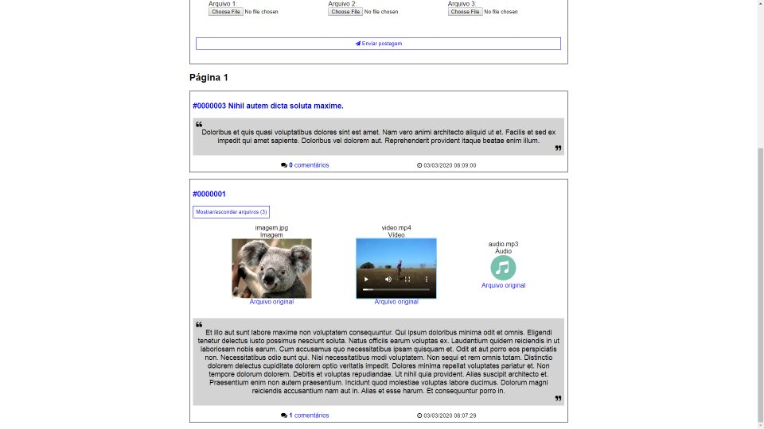
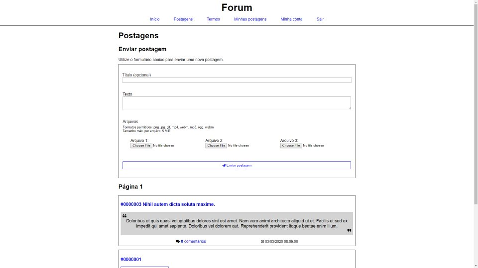
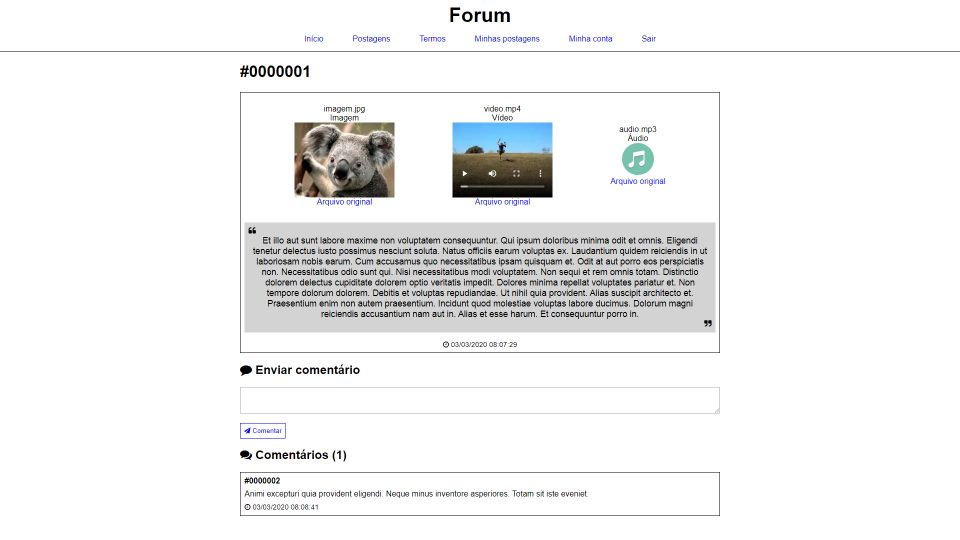
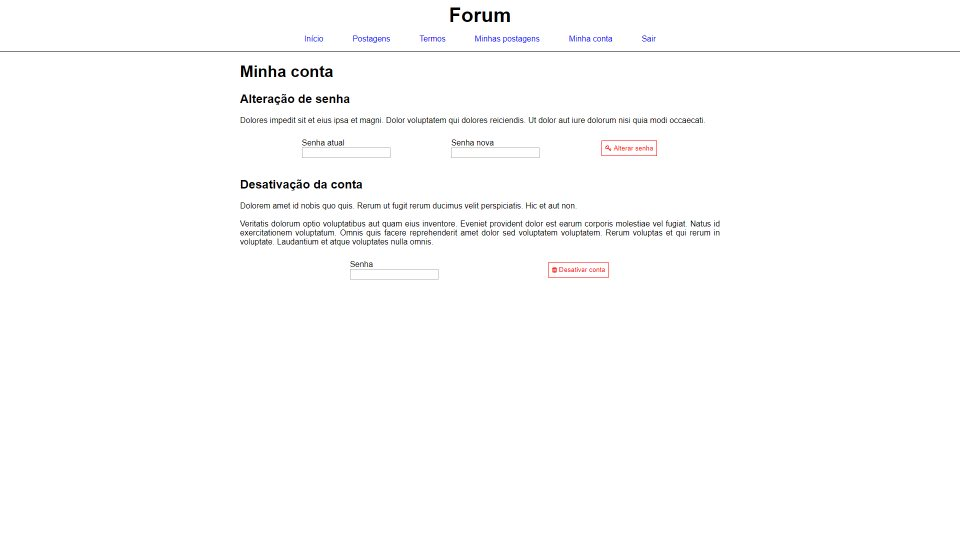

# Forum
Fórum onde usuários registrados podem enviar postagens e comentários anonimamente.

O motivo para a criação deste site foi aplicar os conhecimentos que obtive recentemente sobre o 
framework ASP.NET Core, então **nenhuma contribuição será aceita**. Fique a vontade para fazer *fork* do projeto 
e utilizar como quiser, contanto que respeite as licenças dos *frameworks*, ferramentas e tecnologias nele contidos.

Um site com uma versão modificada do código deste repositório está disponível no link: https://forumpedropablo.azurewebsites.net/

## Imagens (da versão não-modificada)

  
  
  
  

## Funcionalidades principais
* Envio de postagens anônimo (para outros usuários);
* Envio de arquivos de mídia (imagens, vídeos e áudios);
* Comentários em postagens;
* Lista com todas as postagens e comentários do usuário autenticado.
